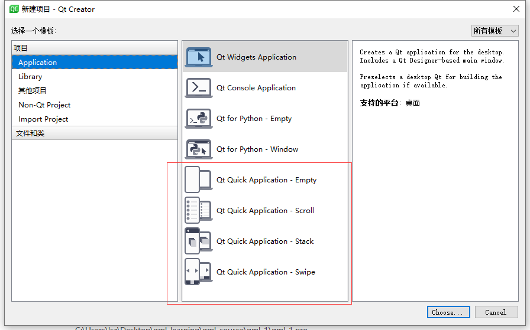

# qt quick 和 qml

qml全程`Qt Meta Language`,是qt的一门语言，是一种类似html的基于`javaScrpit`的声明式脚本语言，而qt quick是qml的一个数据类型和功能的标准库，提供了可视化类型、交互类型、动画、模型和视图、粒子特效和渲染特效标准库，方便用户快速构建出炫酷的界面。

qml与qt quick就像c++和std的关系一样，前者是一个语言，后者是在语言基础上提供的强大的官方库。

# 创建第一个项目

点击新建项目，选择如果所示创建qml项目:



根据向导进入到编辑界面：

```cpp
import QtQuick 2.14
import QtQuick.Window 2.14

Window {
    visible: true
    width: 640
    height: 480
    title: qsTr("Hello World")
}
```